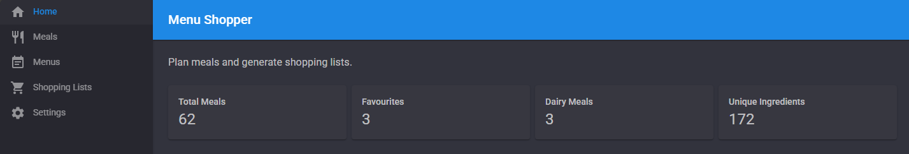
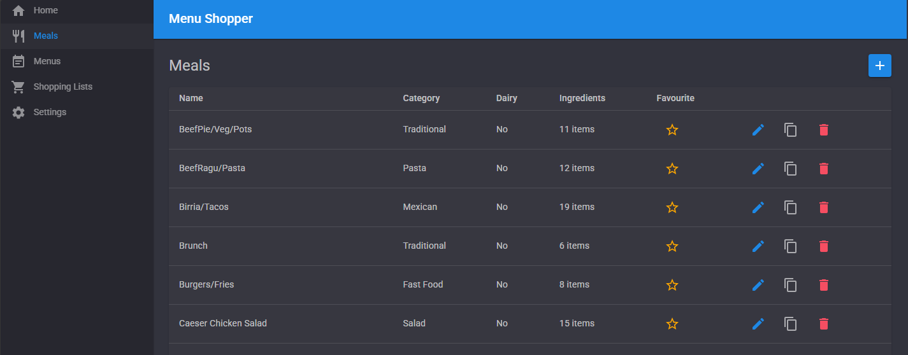
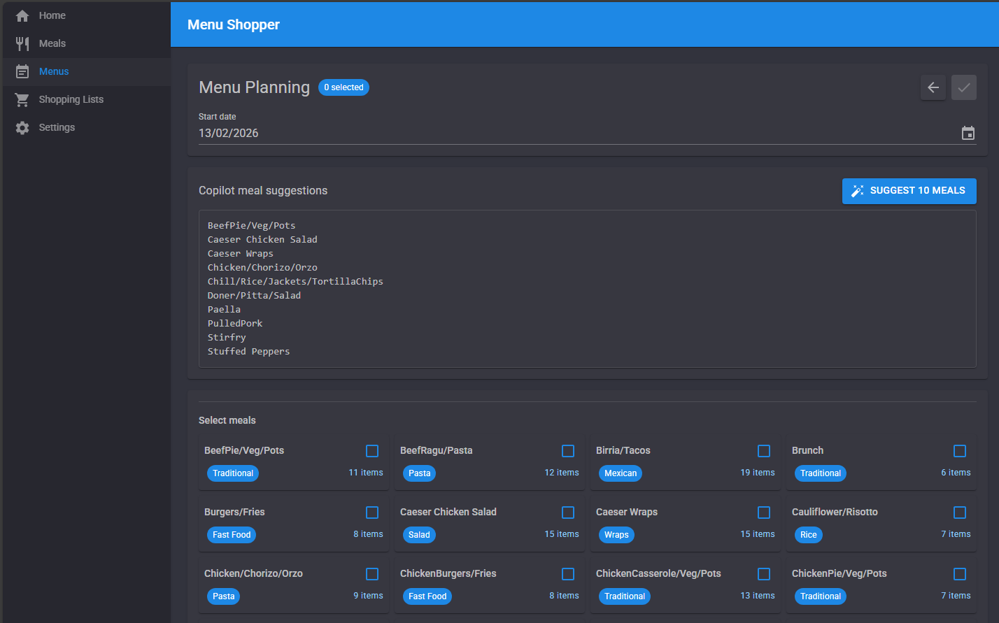

[](https://github.com/woanware/MenuShopper/actions/workflows/dotnet.yml)

# MenuShopper

MenuShopper is a local-first meal planning application for building weekly menus and generating practical shopping lists in minutes.

## Highlights
- Responsive, multi-column card layouts for menu planning and shopping lists.
- Sticky planning header with visible selected-meal count while scrolling.
- Copilot-powered meal suggestions (10 recommendations) informed by recent menus and planning rules.
- Copilot emoji list generation for menu summaries, including response validation.
- Structured meal library with categories, favourites, and dairy flags.
- Auto-generated shopping lists with custom items, bought tracking, and export to text file.

## Feature overview

### Dashboard
- At-a-glance totals for meals, favourites, dairy meals, and unique ingredients.

### Meals
- Create, edit, clone, and delete meals.
- Manage categories, ingredients, dairy flags, and favourites.

### Menu planning
- Build or edit menus using a compact, responsive meal-card grid.
- Select meals quickly with clear visual selection states.
- Generate Copilot meal suggestions in-page and review results in a dedicated output panel.

### Menu details
- Review menu metadata (start date, meal count, item count).
- Generate and copy an emoji-formatted meal list via Copilot.

### Shopping lists
- Open shopping lists from menus with item and remaining counts.
- Manage list items in a responsive card grid with fast bought/delete actions.
- Add custom items with keyboard-friendly entry (Enter to add next item).
- Export shopping lists as `.txt`.

### Settings
- View the exact local data folder path used by the app.

## Screenshots

| Home Dashboard | Meals |
| --- | --- |
|  |  |

| Menu Planning | Shopping List |
| --- | --- |
|  |  |

## Getting started

### Prerequisites
- .NET 10 SDK

### Run locally
```bash
cd MenuShopper
dotnet restore
dotnet run
```

Then open the URL shown in the console.

## Data storage
MenuShopper stores data locally using JSON files under the runtime `Data` directory (including menu files in `Data/Menus`).  
You can see the active absolute data path in the **Settings** page.

## Tech stack
- ASP.NET Core Razor Components (.NET 10)
- MudBlazor
- GitHub Copilot SDK
