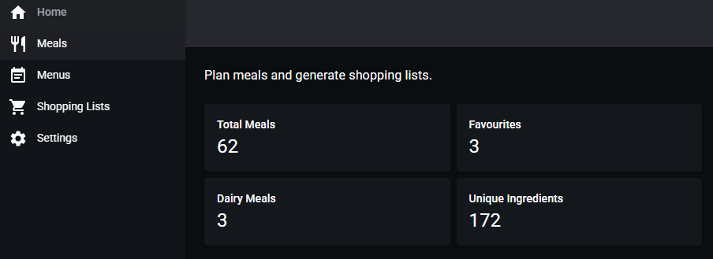
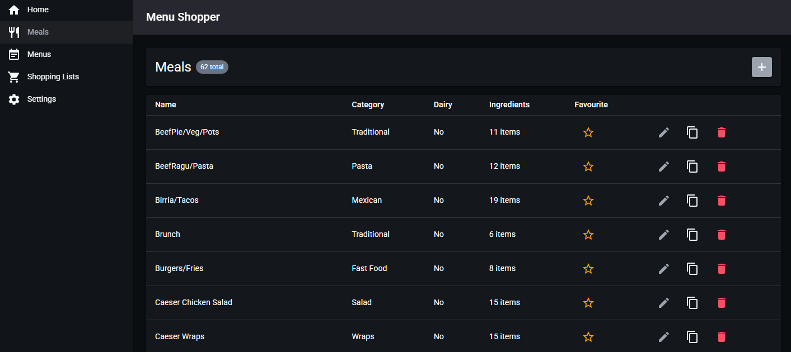
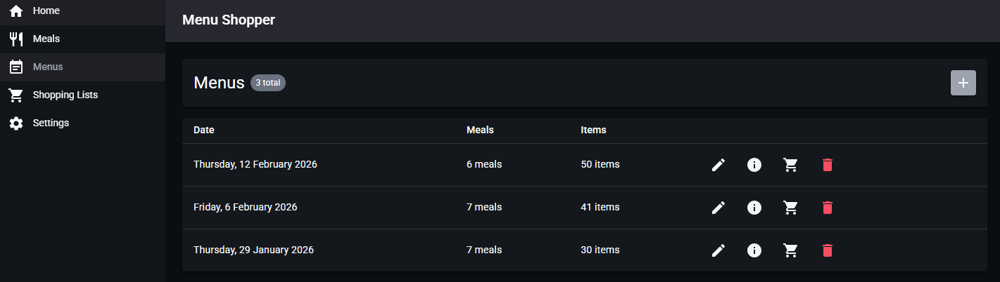
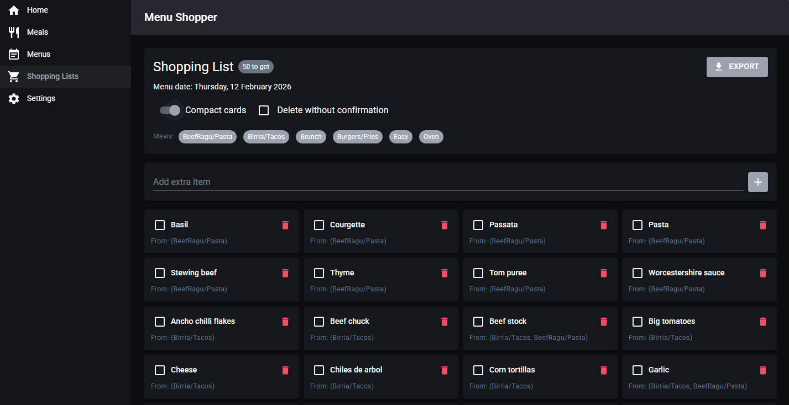

[](https://github.com/woanware/MenuShopper/actions/workflows/dotnet.yml)

# MenuShopper

MenuShopper is a local-first meal planning application for building weekly menus and generating practical shopping lists in minutes.

## ✨ Highlights
- Responsive, multi-column card layouts for menu planning and shopping lists.
- Sticky planning header with visible selected-meal count while scrolling.
- Meal Suggestions (Copilot-powered, 10 recommendations) informed by recent menus and planning rules.
- Copilot emoji list generation for menu summaries, including response validation.
- Ingredient Extraction (Copilot-powered recipe-to-ingredient parsing) when creating/editing meals, with inline editing for quick corrections.
- Structured meal library with categories, favourites, and dairy flags.
- Auto-generated shopping lists with custom items, bought tracking, and Markdown export.
- Optional Windows startup integration (prompt on first run + Settings toggle).

## 🧭 Typical workflow
1. Add your meals to the library with category, dairy flag, favourite flag, and associated ingredients (manually or by pasting a recipe and using Ingredient Extraction).
2. Create a menu by selecting meals for the week in **Menu Planning**.
3. Use Meal Suggestions to get 10 additional meal ideas based on recent history and planning rules.
4. Save the menu to generate a shopping list automatically from all selected meal ingredients.
5. Update, check off, and export your shopping list for use on mobile, desktop, or print.

## 📚 Feature overview

### Dashboard
- At-a-glance totals for meals, favourites, dairy meals, and unique ingredients.

### Meals
- Create, edit, clone, and delete meals.
- Manage categories, ingredients, dairy flags, and favourites.
- Paste recipe text and use Ingredient Extraction to extract ingredient names into the meal, then edit any items inline.

### Menu planning
- Build or edit menus using a compact, responsive meal-card grid.
- Select meals quickly with clear visual selection states.
- Generate Meal Suggestions in-page and review results in a dedicated output panel.

### Menu details
- Review menu metadata (date, meal count, item count).
- Generate and copy an emoji-formatted meal list via Copilot.

### Shopping lists
- Open shopping lists from menus with item and remaining counts.
- Manage list items in a responsive card grid with fast bought/delete actions.
- Add custom items with keyboard-friendly entry (Enter to add next item).
- Export shopping lists as Markdown (`.md`) with checkbox formatting.

### Settings
- View the exact local data folder path used by the app.
- On Windows, optionally enable/disable starting MenuShopper with Windows.

## 🤖 Copilot integration

MenuShopper uses the **GitHub Copilot SDK** for:
- in-page Meal Suggestions during menu planning
- emoji list generation on menu details
- recipe text → Ingredient Extraction when creating/editing meals

### Setup (local/dev)
1. Get GitHub Copilot access (Copilot Pro/Business/Enterprise):  
   https://github.com/features/copilot
2. Install GitHub CLI (`gh`):  
   https://cli.github.com/
3. Sign in from your terminal:
   ```bash
   gh auth login
   ```
4. If you use Copilot from CLI tools, install/auth the Copilot extension:
   ```bash
   gh extension install github/gh-copilot
   gh copilot auth login
   ```
5. For headless/CI scenarios, use a supported token environment variable (for example `COPILOT_GITHUB_TOKEN`).

### References
- GitHub Copilot SDK repository: https://github.com/github/copilot-sdk
- SDK authentication docs: https://github.com/github/copilot-sdk/blob/main/docs/auth/index.md

## 🚀 Getting started

### Prerequisites
- .NET 10 SDK

### Run locally
```bash
cd MenuShopper
dotnet restore
dotnet run
```

Then open the URL shown in the console.

## ⚙️ Configuration
MenuShopper uses standard ASP.NET Core configuration file in the project root:
- `MenuShopper/appsettings.json`

### Current key values
From `appsettings.json`:
- `Urls`: `"http://0.0.0.0:5000"`  
  Used by `Program.cs` to bind the web server URL (`builder.Configuration["Urls"]` + `UseUrls(...)`).

### Common change
To run on a different port, update `Urls` in `appsettings.json`, for example:
```json
"Urls": "http://0.0.0.0:5050"
```

## 💾 Data storage
MenuShopper stores data locally using JSON files under the runtime `Data` directory (including menu files in `Data/Menus`).  
You can see the active absolute data path in the **Settings** page.

The app may also store small user settings in this folder (for example, whether you have already seen the Windows startup prompt).

## 🏗️ Tech stack
- ASP.NET Core Razor Components (.NET 10)
- MudBlazor
- GitHub Copilot SDK

## 📸 Screenshots

### 🏠 Home Dashboard


### 🍽️ Meals


### 🗓️ Menu Planning


### 🛒 Shopping List

